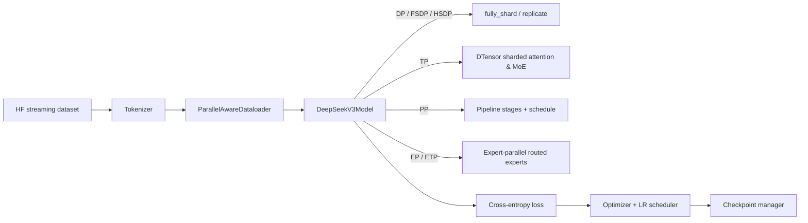

# DeepSeek-V3 Distributed Training

A lightweight, [torchtitan](https://github.com/pytorch/torchtitan)-inspired PyTorch framework for pre-training
DeepSeek-V3-style Mixture-of-Experts language models at scale, using native `torch.distributed` (DTensor,
`fully_shard`, pipelining) parallelism primitives — no external parallelism frameworks required.

This repository re-implements the composable, "N-D parallelism" architecture pioneered by torchtitan
(FSDP2/`fully_shard` + DTensor + native pipeline parallel) and applies it to DeepSeek-V3's architecture:
Multi-Head Latent Attention (MLA), fine-grained DeepSeekMoE with auxiliary-loss-free load balancing,
and YaRN-extended rotary embeddings.

## Features

- **6-way composable parallelism**, all combinable in a single run:
  - **Data Parallel**: DDP (`replicate`), FSDP2 (`fully_shard`), and HSDP (hybrid replicate + shard)
  - **Tensor Parallel (TP)** with Sequence Parallel and optional loss-parallel
  - **Pipeline Parallel (PP)** with configurable schedules (1F1B, Interleaved1F1B, ZBVZeroBubble, ...)
  - **Context Parallel (CP)** for long-sequence training via ring/all-gather attention
  - **Expert Parallel (EP)** and **Expert Tensor Parallel (ETP)** for MoE routed experts, including a
    custom Triton kernel for token permutation/grouped-GEMM dispatch
- **DeepSeek-V3 model**: Multi-Head Latent Attention with low-rank Q/KV compression, decoupled RoPE,
  YaRN context extension, and DeepSeekMoE with auxiliary-loss-free expert load balancing
- **Inference-only latent KV cache** for MLA, with an optional weight-absorption path, guarded so it can
  never interfere with the distributed training loop
- Activation checkpointing (full or fine-grained selective/op-level), `torch.compile` support,
  async/sharded checkpointing via `torch.distributed.checkpoint`, and WandB metrics logging

## Architecture at a glance



## Repository layout

```
src/
  train.py                     Trainer: init, train loop, checkpointing, metrics
  components/
    checkpoint.py               Async/sharded checkpointing (torch.distributed.checkpoint)
    dataloader.py                Stateful, data-parallel-aware dataloader
    loss.py                      Token-normalized cross-entropy loss
    lr_scheduler.py               Warmup-stable-decay LR schedule
    metrics.py                    Throughput / MFU / memory / WandB logging
    optimizer.py                  Multi-model-part optimizer + MoE load-balancing hook
    tokenizer.py                  DeepSeek-V3 tokenizer wrapper
  config/                        Job configuration dataclasses + parallelism presets
  dataset/hf_datasets.py          Streaming HF dataset -> token-packed training samples
  distributed/
    parallel_dims.py               N-D device mesh construction (torchtitan-style)
    model_parallel.py               DDP / FSDP2 / HSDP application
    expert_parallel.py              Expert Parallel + Expert Tensor Parallel (MoE)
    pipeline_parallel.py            Pipeline stage splitting + schedules
    activation_checkpoint.py        Full / selective / per-op activation checkpointing
    utils.py                        Reductions, gradient clipping, AMP, CP context, determinism
  model/
    model.py                        DeepSeekV3Model, TransformerBlock, MLA Attention
    args.py                         Model hyperparameters + FLOPs/param counting
    rope.py                         RoPE + YaRN frequency scaling
    sdpa.py                         SDPA wrapper (CP-compatible, causal masking incl. KV cache)
    kv_cache.py                     Inference-only compressed-latent KV cache for MLA
    parallelize.py                  Wires TP/EP/AC/compile/FSDP together per model
    moe/                            DeepSeekMoE: router, grouped-GEMM experts, Triton permute kernel
  tools/                          Device utils, profiling, peak-FLOPS tables, GC control
scripts/
  slurm_train.sbatch              SLURM launch script (srun + torchrun, multi-node)
tests/                          CPU/gloo-backed unit tests (pytest)
```

## Papers behind each component

Every architectural or systems choice in this repository traces back to a specific paper. This section
maps repository components to their source references.

### Model architecture (DeepSeek-V2 / V3)

| Component | Paper | Notes |
|---|---|---|
| Multi-Head Latent Attention (MLA) — [`src/model/model.py`](src/model/model.py) | [DeepSeek-V2](https://arxiv.org/abs/2405.04434) (§2.1) | Low-rank joint compression of K/V into a shared latent `c^KV`, decoupled RoPE key, ~93.3% KV-cache reduction |
| MLA weight absorption + latent KV cache — [`src/model/kv_cache.py`](src/model/kv_cache.py), `Attention.forward_absorbed` | [DeepSeek-V2](https://arxiv.org/abs/2405.04434) (§2.1), [DeepSeek-V3](https://arxiv.org/abs/2412.19437) | Cache only the compressed latent + rotary key; absorb `W^UK`/`W^UV` into `W^Q`/`W^O` to avoid re-materializing per-head K/V |
| DeepSeekMoE (fine-grained + shared experts) — [`src/model/moe/moe.py`](src/model/moe/moe.py) | [DeepSeekMoE](https://arxiv.org/abs/2401.06066), [DeepSeek-V2](https://arxiv.org/abs/2405.04434) (§2.2) | Fine-grained expert segmentation with always-active shared experts to isolate common knowledge |
| Auxiliary-loss-free load balancing — [`src/components/optimizer.py`](src/components/optimizer.py) `_update_expert_bias`, [`src/model/moe/moe.py`](src/model/moe/moe.py) `expert_bias` | [Auxiliary-Loss-Free Load Balancing](https://arxiv.org/abs/2408.15664), [DeepSeek-V3](https://arxiv.org/abs/2412.19437) | Per-expert bias added only to routing scores (not gating values), updated by sign of usage imbalance — avoids the quality cost of an auxiliary balancing loss |
| Multi-token prediction / overall architecture, training recipe — [`src/train.py`](src/train.py), [`src/config/default_configs.py`](src/config/default_configs.py) | [DeepSeek-V3](https://arxiv.org/abs/2412.19437) | Reference hyperparameters (dims, layer counts, MoE config) mirror the DeepSeek-V3 technical report |
| YaRN rotary position extension — [`src/model/rope.py`](src/model/rope.py) | [YaRN](https://arxiv.org/abs/2309.00071) | NTK-by-parts interpolation ramp between scaled and unscaled RoPE frequencies for context extension beyond the pretraining length |
| RoPE (base mechanism) — [`src/model/rope.py`](src/model/rope.py) | [RoFormer](https://arxiv.org/abs/2104.09864) | Rotary position embeddings via complex-plane rotation |
| SwiGLU feed-forward — [`src/model/moe/moe.py`](src/model/moe/moe.py) `FeedForward` | [GLU Variants Improve Transformer](https://arxiv.org/abs/2002.05202) | Standard gated FFN activation used for both dense layers and (shared/routed) experts |
| RMSNorm — used throughout `src/model/model.py` | [Root Mean Square Layer Normalization](https://arxiv.org/abs/1910.07467) | Simplified LayerNorm without mean-centering, used for all norms |

### Distributed training systems (torchtitan-inspired)

This repository's parallelism engine is a direct, from-scratch re-implementation of the design principles
published by the **torchtitan** team, adapted to DeepSeek-V3's MoE architecture:

| Component | Reference | Notes |
|---|---|---|
| N-D device mesh composition — [`src/distributed/parallel_dims.py`](src/distributed/parallel_dims.py) | [torchtitan](https://arxiv.org/abs/2410.06511) ([repo](https://github.com/pytorch/torchtitan)) | Single flattened world mesh, unflattened into named PP/DP-replicate/DP-shard/CP/TP/EP/ETP sub-meshes, matching torchtitan's meta-parallelism design |
| FSDP2 / `fully_shard` sharded data parallel — [`src/distributed/model_parallel.py`](src/distributed/model_parallel.py) | [PyTorch FSDP2](https://arxiv.org/abs/2304.11277) (design continuation), torchtitan | `DTensor`-based per-parameter sharding with `MixedPrecisionPolicy`, explicit prefetching for MoE modules |
| Tensor + Sequence Parallel — [`src/model/parallelize.py`](src/model/parallelize.py) | [Megatron-LM](https://arxiv.org/abs/1909.08053), [Reducing Activation Recomputation (Sequence Parallel)](https://arxiv.org/abs/2205.05198), torchtitan | Column/row-wise sharded attention & MLP with sequence-sharded norms between TP regions |
| Pipeline Parallel schedules — [`src/distributed/pipeline_parallel.py`](src/distributed/pipeline_parallel.py) | [GPipe](https://arxiv.org/abs/1811.06965), [PipeDream / 1F1B](https://arxiv.org/abs/1806.03377), [Zero Bubble Pipeline Parallelism](https://arxiv.org/abs/2401.10241), torchtitan | Single/looped/V-shaped stage placement built on `torch.distributed.pipelining` |
| Context Parallel (ring attention) — used via `src/distributed/utils.py` `create_context_parallel_ctx` | [Ring Attention](https://arxiv.org/abs/2310.01889), [Striped Attention](https://arxiv.org/abs/2311.09431), torchtitan | All-gather/all-to-all KV exchange for causal ring attention over sharded sequences |
| Expert Parallel (token-level all-to-all) — [`src/distributed/expert_parallel.py`](src/distributed/expert_parallel.py), Triton permute kernel in [`src/model/moe/kernels.py`](src/model/moe/kernels.py) | [GShard](https://arxiv.org/abs/2006.16668), [Switch Transformer](https://arxiv.org/abs/2101.03961), torchtitan | Dispatch/combine routed tokens across EP ranks via all-to-all, grouped-GEMM after local-expert-major permutation |
| Selective activation checkpointing — [`src/distributed/activation_checkpoint.py`](src/distributed/activation_checkpoint.py) | [Reducing Activation Recomputation](https://arxiv.org/abs/2205.05198), torchtitan | Per-layer or per-op (recompute-vs-save policy) checkpointing to trade memory for compute |
| Mixed-precision training, gradient clipping across PP/EP meshes — [`src/distributed/utils.py`](src/distributed/utils.py) | [Mixed Precision Training](https://arxiv.org/abs/1710.03740), torchtitan | FP32 master gradient reduction with BF16 params/activations; norm combined across PP stages and EP/non-EP parameter groups before clipping |
| Model FLOPs Utilization (MFU) metric — [`src/components/metrics.py`](src/components/metrics.py) | [PaLM](https://arxiv.org/abs/2204.02311) (§Efficiency) | `MFU = 100 * flops_per_token * tokens_per_sec / peak_device_flops` |

## Quick start

```bash
# Install dependencies (uv is the supported package manager)
uv sync

# Launch training with a preset parallelism config (see src/config/default_configs.py)
export src_CONFIG=fsdp        # one of: ddp, fsdp, hsdp, pp_tp, fsdp_tp, fsdp_cp,
                               #         hsdp_ep, fsdp_ep_tp, fsdp_ep_etp
torchrun --nproc_per_node=<N> -m src.train
```

Each preset in [`src/config/default_configs.py`](src/config/default_configs.py) configures a different
combination of parallelism dimensions (`data_parallel_shard_degree`, `tensor_parallel_degree`,
`pipeline_parallel_degree`, `context_parallel_degree`, `expert_parallel_degree`,
`expert_tensor_parallel_degree`) on top of the shared DeepSeek-V3 model/training defaults.

## Running on SLURM

Multi-node training is supported via [`scripts/slurm_train.sbatch`](scripts/slurm_train.sbatch), which
wraps `torchrun` with `srun` and derives the rendezvous endpoint from the SLURM node list (`c10d`
rendezvous backend, one `torchrun` launcher process per node):

```bash
export src_CONFIG=fsdp        # one of: ddp, fsdp, hsdp, pp_tp, fsdp_tp, fsdp_cp,
                               #         hsdp_ep, fsdp_ep_tp, fsdp_ep_etp
sbatch --nodes=2 --gpus-per-node=8 scripts/slurm_train.sbatch
```

Notes:
- `--nodes` × `--gpus-per-node` must equal the world size implied by your chosen `src_CONFIG` preset's
  parallelism degrees.
- `--ntasks-per-node=1` is required — `torchrun` itself spawns one process per GPU on each node.
- Override `MASTER_PORT` (default `29500`) if it collides with another job on the same node.

## Testing

The test suite runs entirely on CPU using the `gloo` backend (no GPU required):

```bash
uv sync --group dev
uv run pytest tests/ -v
```

Coverage includes: MLA attention (with and without the KV cache / weight absorption), RoPE/YaRN,
DeepSeekMoE routing and grouped experts, the loss function, LR scheduler, optimizer container, and
`ParallelDims`/distributed-reduction primitives over multi-process `gloo` process groups.

## Acknowledgements

- [torchtitan](https://github.com/pytorch/torchtitan) — this repository's device-mesh, FSDP2/DTensor,
  pipeline-parallel, and activation-checkpointing designs are directly inspired by (and in places
  closely follow) torchtitan's reference implementation.
- [DeepSeek-AI](https://github.com/deepseek-ai) — the model architecture (MLA, DeepSeekMoE,
  auxiliary-loss-free balancing, YaRN) follows the DeepSeek-V2/V3 technical reports.

## License

Apache License 2.0 — see [LICENSE](LICENSE).
